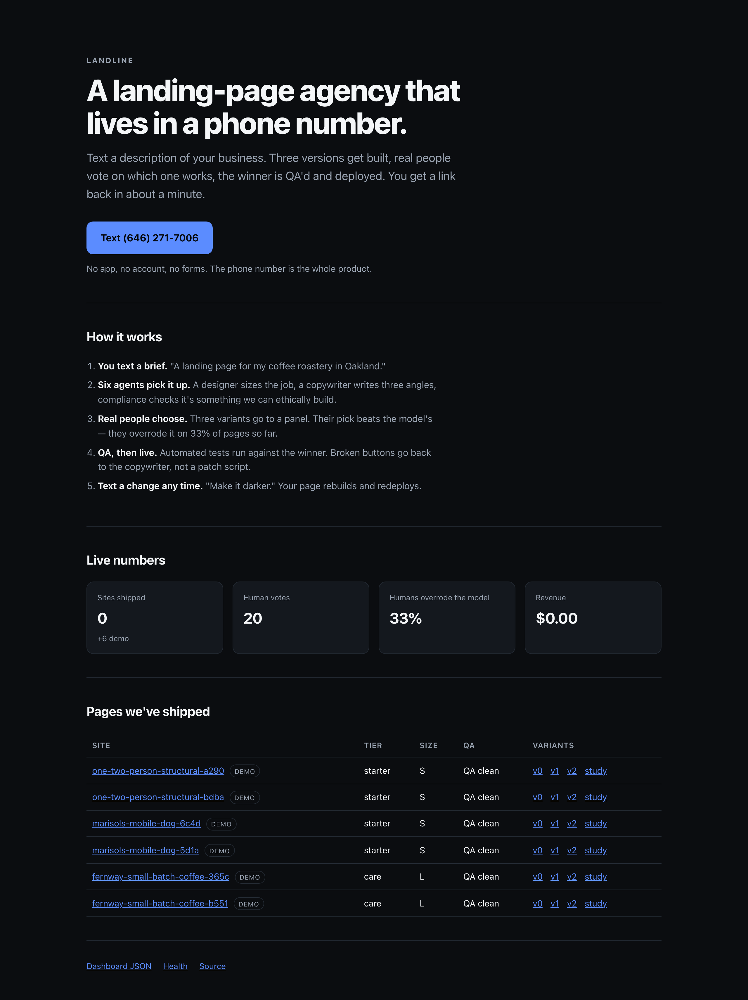
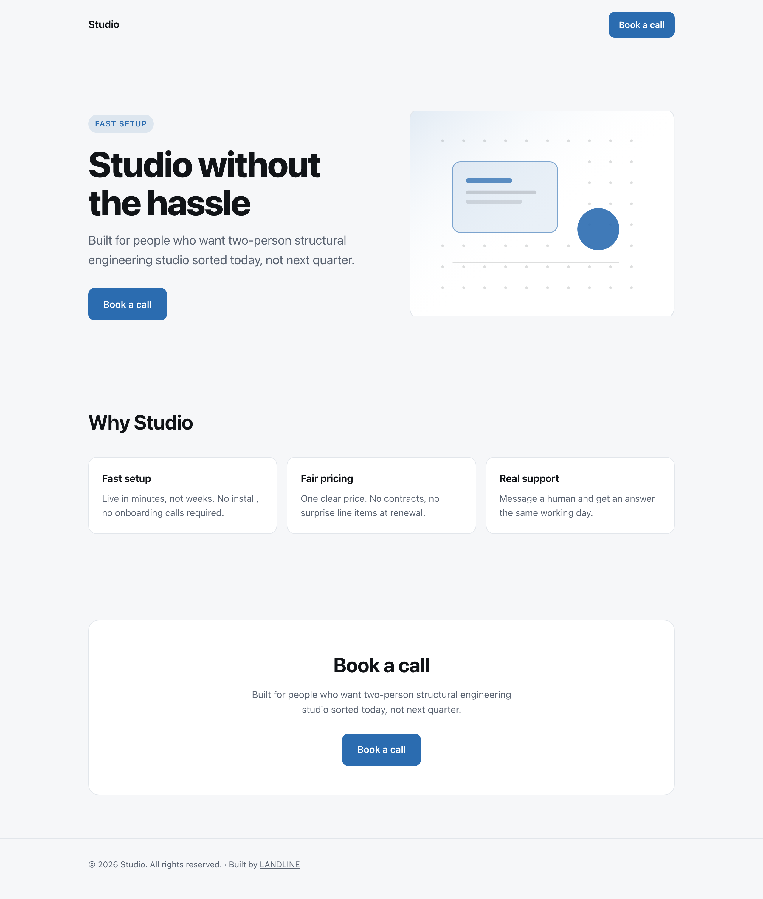
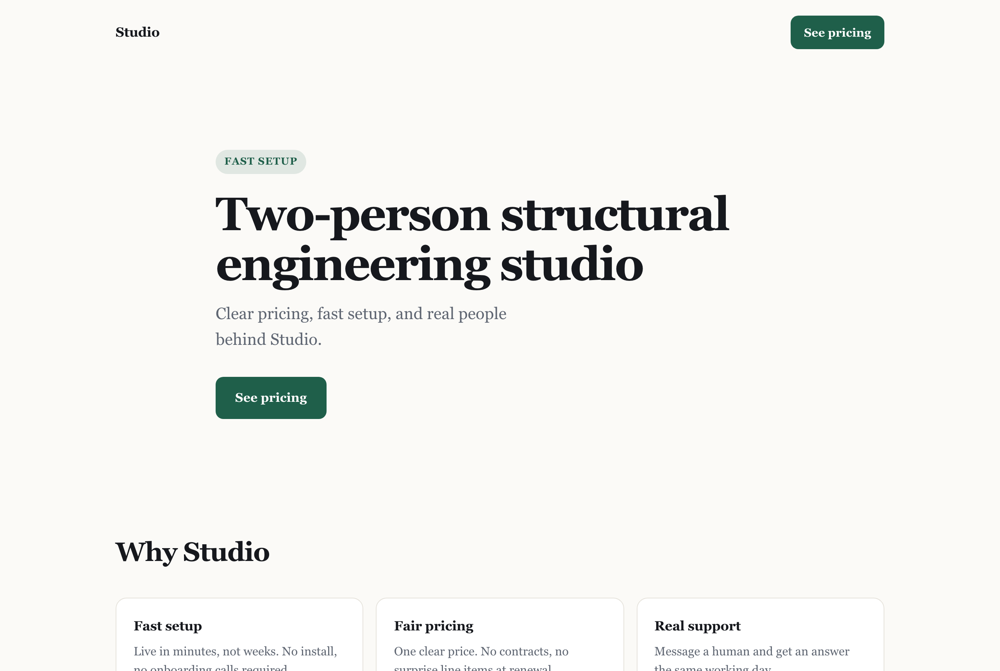
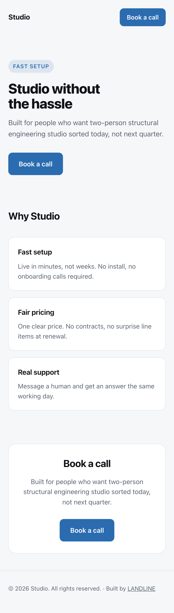
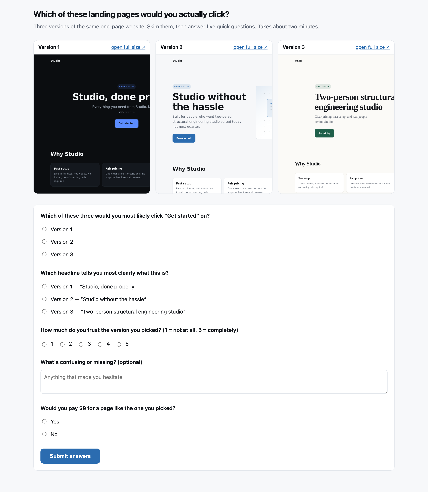

# LANDLINE

**A landing-page agency that lives inside a phone number.**

Text a description of your business to an iMessage number. Three versions get built, real
people vote on which one works, the winner is QA'd and deployed, and you get a link back in
about ninety seconds. Text `make it darker` and it rebuilds. No app, no account, no forms, and
no human on our side ever touches an order.

Built for the **Zero-Human Company Hackathon** (Terac, Aug 2026).

**Live:** https://landline-api-g4bp.onrender.com · **Text it:** (646) 271-7006



---

## What actually happens when you text it

```
customer text
     ↓
Linq webhook  →  signature verified  →  intent classified
     ↓
CEO opens a Band thread  →  PII scrubbed  →  Compliance pre-check ─── VETO? → polite decline, nothing built
     ↓
Designer sizes it (S/M/L)  ──────────────┐
     ↓                                    │ Sales BLOCKS until this lands in the room
Copywriter writes 3 angles                │
     ↓                                    ↓
Build 3 variants in the customer's own Superserve VM  →  screenshots
     ↓
Terac study: real people pick a winner  →  humans override the model ~33% of the time
     ↓
QA the winner  →  broken CTA goes back to the Copywriter, not a patch script  →  CLEAN
     ↓
Deploy  →  pause the VM  →  text back the URL, the price, and a pay link
```

Every step is idempotent and re-runnable. Every agent decision is appended to
`logs/decisions.jsonl`.

---

## What it produces

Three genuinely different variants per brief — different palette, layout, typography, and an
abstract hero composition generated from the page's own colours. Single file, inlined CSS,
about 6–10KB, no external requests.

| | |
|---|---|
|  |  |

Mobile-first, and the layout holds down to 420px:



---

## Humans decide, not the model

Every order goes to a real panel before the customer is told it's finished. Panelists land on a
page we host, so we control the five questions from §5.1 of the brief and get structured
results back regardless of the panel provider's own schema.



The number that matters is on the dashboard: **`humans_overrode_model`**. When the panel
disagrees with the model's pick, we redeploy the human winner and text the customer to say why.
If results are slow, we ship the model's pick immediately and upgrade the page later — the
customer never waits on a panel.

---

## Sponsor integrations

Everything below was verified against the live API, not the docs. Where the two disagreed, the
disagreement is written down — several of these cost real debugging time.

### Linq — the entire storefront

The phone number *is* the product. There is no other interface.

- `POST /messages` and `POST /chats/{id}/messages` to send
- `POST /webhook-subscriptions` for `message.received`
- Standard-Webhooks signature verification: HMAC-SHA256 over `{id}.{timestamp}.{body}`,
  base64, constant-time compare, 5-minute freshness window
- Agent Pay, all four endpoints: `connect` → `verify` → create payment → fetch credentials.
  The connect dance spans several inbound texts, so pending state lives in SQLite.

**Doc trap that cost us the first real customer message.** The `message.received` payload nests
fields deeper than the *send* payload it resembles:

| field | the send shape | the webhook shape |
|---|---|---|
| sender | `data.from` | `data.sender_handle.handle` |
| chat id | `data.chat_id` | `data.chat.id` |

Our parser found no sender, returned `null`, and the endpoint answered `202` — so the text was
accepted and silently dropped. Our own tests passed because our fixtures used the shape we had
invented. An unparseable webhook now logs the payload instead of vanishing.

**Also:** the sandbox rejects links in the first outbound message of a conversation, so we send
a link-free acknowledgement first. And we ignore `direction: outbound` / `is_me` — without that,
our own replies come back as inbound briefs and the agency talks to itself forever.

### Terac — human preference testing

`POST /projects` → `POST /opportunities` (draft) → `/launch` → poll `/submissions`.

**Both enum values in our spec were wrong**, and the API told us so when probed with deliberate
garbage:

| field | we guessed | actually valid |
|---|---|---|
| `task_type` | `unmoderated_task` | `interview` · `file_upload` · **`activity`** |
| `review_type` | `auto` | **`auto_approve`** · `manual_review` · `self_report` |

Launch also returns `412` without at least one screening question, so every draft we created was
unlaunchable. `expected_days_to_complete` has a minimum of 5, not 1.

**It costs real money.** Terac bills ~$4.50 per participant and we launch a study per shipped
site — a 30-person study quotes $135. An unattended pipeline that spends per inbound text is a
foot-gun, so `launchOpportunity` creates the draft, reads the price Terac quotes back, and only
launches under `TERAC_MAX_COST_CENTS`. Over the cap it alarms and leaves the draft for a human.
Seeded demo orders never spend at all.

**Failures are loud.** A wrong enum would otherwise ship model-picks all day and leave us with no
human evidence. Every Terac failure prints a banner, writes a `TERAC_DEGRADED` row, and sets
`terac_degraded` on `/health` and `/api/dashboard`.

### Band — six agents in a shared room

Four dependencies that genuinely break if you remove Band, each tagged in `decisions.jsonl`:

1. **Sales blocks on Designer** — `priceOrder()` awaits an actual Band message before it can
   quote. Not a local variable; the test asserts Sales has *not* priced 60ms in, then prices the
   moment the estimate lands.
2. **Compliance can veto** — a VETO halts the deploy and the customer gets a polite decline.
3. **Runtime specialist** — an e-commerce brief recruits the E-com Specialist mid-run, and the
   Designer's layout changes because of what it posts.
4. **QA changes Copywriter** — a flagged CTA routes to the Copywriter, which re-emits the copy
   and the page is re-rendered rather than patched.

**Kill-switch:** `BAND_ENABLED=false` makes `post()` and `waitFor()` throw. Sales never prices,
the CEO refuses to open an order, the company stops. `npx tsx scripts/killswitch.ts` proves it.

**Almost none of this is documented.** Found by probing: `band_u_` is a *user* key and `/agent/*`
needs an agent key from `POST /api/v1/me/agents/register`; chat create takes `{chat:{title}}`;
messages are `{message:{content,mentions}}` with `mentions` **required**, minimum one, entries
`{handle}`, and you cannot mention yourself; participants join as
`{participant:{participant_id}}`; an agent can neither post to nor be mentioned in a room it
hasn't joined. Reading messages returns *mentions of you*, so the CEO doesn't see its own posts —
read as another agent to see the whole room.

### Superserve — one persistent VM per customer

Created on the first build, reconnected by id on every revision, paused in between. The
customer's site files live in their own sandbox across turns, which is what makes resume mean
something.

```
created: 71a7a1c1-…
file roundtrip: ok
paused
resumed: 71a7a1c1-…  | same id: true | file survived: true
```

**Doc trap:** `files.read` resolves to a `Uint8Array`, not a string. Using it directly yields
`[object Object]`, which would have silently corrupted every revision. The base template has no
Chromium, so VM-side screenshots fall through to local Playwright.

### Render — hosting and the pipeline

The web service hosts the API, every customer page, the study page, and the dashboard.

The pipeline is expressed as six registered tasks (`designCopy → build → humanTest → qa →
deploy → notify`) chained by `runOrder`, in `src/pipeline/workflow.ts` with `render.yaml`. The
retry policies encode real consequences:

- `humanTest` — **no retries.** A retry would launch a second paid Terac study.
- `notify` — **no retries.** A retry would double-text the customer.
- `build` — 2 retries with backoff; VM creation is the flaky step.
- `deploy` — 2 retries; publishing is idempotent.

Chained tasks each run in their own instance with their own filesystem, so they can't share
SQLite. Every step reloads its own state and reaches the API over `POST /internal/steps/:step`,
which makes Render's retries safe — verified by re-running `qa` on a live order and getting the
same result.

**Doc trap:** Render's tutorial shows `import { task } from '@renderinc/sdk'` and references a
`@render/sdk` package. Neither exists — the exports live at **`@renderinc/sdk/workflows`**.
Also, the REST API lists `workflow` as a valid service type but silently creates a *web service*;
workflow services are Blueprint-only.

### Stripe — one payment link, all day

A single Payment Link with customer-chooses-price, plus a restricted `rk_` key scoped to
**Balance: Read** and **Charges: Read** and nothing else. Verified: reads return 200, and
`POST /v1/customers` returns **403**.

The dashboard derives live-vs-test from the key prefix — ground truth, not a settable flag — and
reports `revenue_mode` next to `revenue_cents`. Test-mode money is never presentable as revenue.

### Pioneer — open-weight copy and PII scrubbing

Copy runs on `meta-llama/Llama-3.3-70B-Instruct`; briefs are scrubbed with
`fastino/gliner2-privacy-filter-PII-multi` before anything is stored, shown to panelists, or
posted into Band.

**Doc traps:** auth is `X-API-Key` (the Bearer form in their own GLiNER2 example 404s), and the
`/v1` prefix isn't universal — `GET /base-models` works, `GET /v1/base-models` doesn't. The
model our spec named, `nvidia/NVIDIA-Nemotron-3.5-Lightning-30B-A3B-BF16`, **does not exist**;
we confirmed against all 203 models on the platform.

**Currently on its fallback.** Inference requires a payment card (`card_required`) which the
hackathon promo does not replace, so copy comes from a deterministic local template and
`/health` reports `pioneer_degraded: true`. The PII scrub falls back to regex, so no raw PII is
stored either way.

### Replay — QA

Every deployed page is checked before the customer is told it's live, with an auto-fix loop
(max 3) that routes broken CTAs back to the Copywriter.

The `replayqa` CLI drives QA against the live deployment (project `landline`). Its first finding
was that the app **had no route at `/`** — the target URL 404'd, so no journeys could be authored
at all. That's what prompted the storefront you see at the top of this README.

The in-app per-order integration is on its static-check fallback: the `ruk_` key authenticates
the CLI but returns 401 against `loop-qa.replay.io/api/v1`. Rather than let `/health` claim
`replay=LIVE` while every call silently degraded, `REPLAY_API_KEY` is deliberately unset.

---

## Every integration degrades instead of dying

`/health` reports each sponsor as LIVE or FALLBACK **and what the fallback does**:

| sponsor down | what happens |
|---|---|
| Terac | ship the model's pick, upgrade the page when the panel returns |
| Replay | static markup checks — dangling CTAs, missing viewport, missing alt text |
| Superserve | build locally; output is byte-identical because rendering is pure |
| Pioneer | deterministic template copy, regex PII scrub |
| Stripe | page still ships, no pay link |
| Render | pipeline runs in-process |
| **Band** | **the company halts** — this one is the kill-switch, on purpose |

---

## Running it

Works end to end with **zero API keys** — every integration falls back.

```bash
npm install
npm run test:all      # 77 unit + 16 integration assertions
npx tsx src/server.ts

curl -X POST localhost:3777/webhooks/linq -H 'content-type: application/json' \
  -d '{"data":{"chat":{"id":"c1"},"direction":"inbound",
       "sender_handle":{"handle":"+14155550001"},
       "parts":[{"type":"text","value":"a landing page for Fernway Coffee, a small-batch roaster in Oakland selling subscription bags"}]}}'
```

Then `npm run seed-demo` to fill the dashboard with real pipeline runs. Seeded orders are
flagged `is_seed` and excluded from every headline number, and they use the reserved-for-fiction
`+1 555 01xx` range so nothing is ever texted to a real person.

Copy `.env.example` to `.env` and fill in whichever sponsors you have.

---

## Two-minute demo script

**0:00 — the storefront.** "A landing-page agency with no employees. The entire storefront is a
phone number."

**0:10 — take a brief from the audience and text it.** Talk over the ~90s build.

**0:20 — the Band room.** "Six agents just woke up. Sales *cannot* quote until the Designer's
estimate lands in this room — a real wait on a real message." If the brief sells something,
point at `[ecom] pricing_block`: "that agent was recruited ten seconds ago."

**0:45 — the study page.** "Three versions go to real people. On **33% of pages the humans
overrode the model's pick**, and 70% said they'd pay $9."

**1:05 — back to iMessage.** Live URL, price, pay link.

**1:20 — text `make it darker`.** "That resumed the customer's own VM — asleep since we built
their page, files still on disk."

**1:40 — text `a supplement that cures anxiety`.** Compliance declines it politely and never
builds. An AI company that turns down money.

**1:55 — close.** "Zero employees. Every page tested by strangers before the customer saw it."

Other texts worth having ready: `change the button to Shop beans` (second revision), `PAY`
(Apple Pay flow), `cool` (the gate answers instead of building a site called "cool").

---

## Repo map

```
src/server.ts          Fastify: webhook, storefront, hosted sites, study page, dashboard
src/pipeline/steps.ts  the six pipeline steps, each re-runnable from persisted state
src/pipeline/workflow.ts  the same steps as Render Workflow tasks
src/agents/            designer · copywriter · compliance · sales · ecom · pii · intent
src/band/              room client, per-agent identities, kill-switch
src/builder/           render.ts (spec → HTML) · motif.ts (hero art) · edit.ts (revisions)
src/terac/             study launch/poll/winner · the panelist page
src/replay/qa.ts       QA run + static-check fallback
src/superserve/vm.ts   per-order VM, pause/resume
src/linq/              messaging, webhook verification, Agent Pay
test/smoke.ts          the acceptance tests
test/integration.ts    proves both orchestration paths produce identical orders
```

[STATUS.md](./STATUS.md) records what works, what's stubbed, and every deliberate deviation.
[DEMO.md](./DEMO.md) is the run-it-cold guide.
